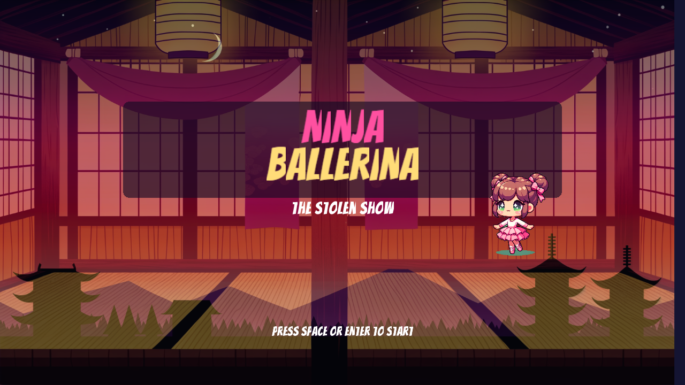
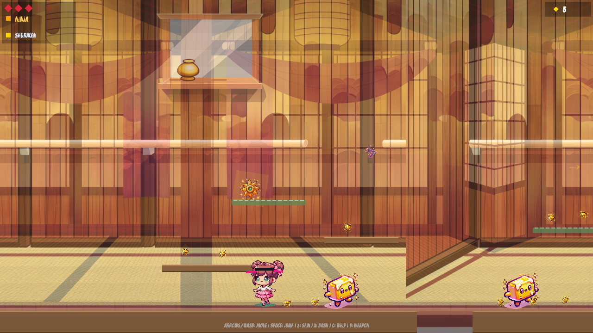
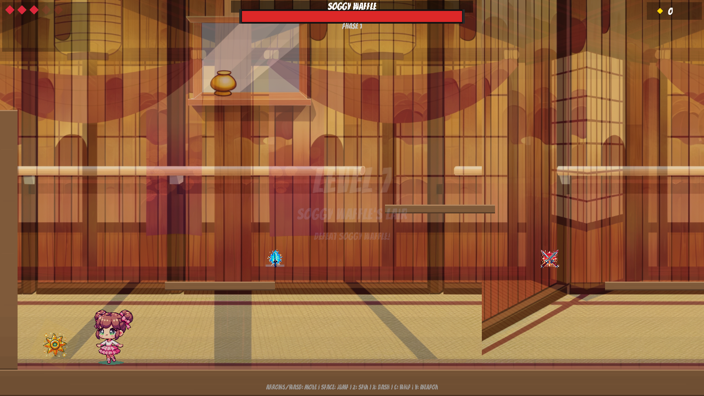
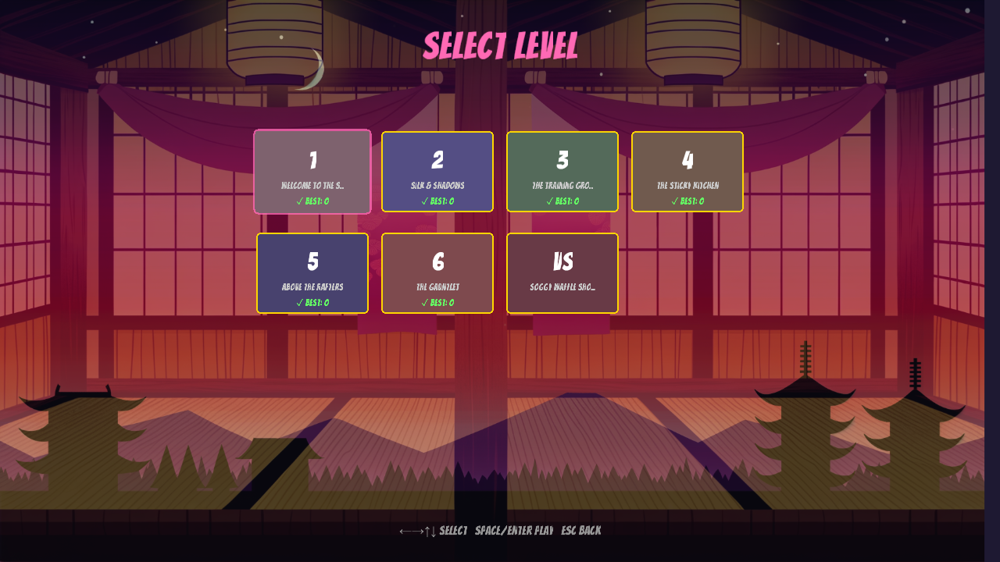

# Ninja Ballerina: The Stolen Show

A 2D side-scrolling platformer where a young ballerina transforms into a ninja to chase down Soggy Waffle and recover the stolen golden ballet slippers.

**[Play it now](https://brianmcr.github.io/ninja-ballerina-platformer/)**



## Gameplay



Run, jump, and spin through a dojo-themed world across 6 levels and a boss fight. Collect sequins, grab the ninja powerup to transform, and master three attack types to defeat breakfast-themed enemies.



## Controls

| Action | Keys |
|--------|------|
| Move | Arrow keys or A/D |
| Jump | Space or W (variable height, hold to float) |
| Spin Attack | Z (AOE, visible yellow ring) |
| Dash | X (i-frames, afterimage trail) |
| Whip | C (ribbon streak) |
| Weapon (ninja form) | V |
| Pause | P or Escape |
| Skip Cutscene | Escape |

## Features

### Mario-inspired feel
- **Apex hang-time** — gravity reduced at jump peak for that controllable float
- **Sprint ramp** — hold a direction to build up to 1.35x running speed
- **Coin combos** — consecutive sequin pickups rise in pitch
- **Stomp chains** — consecutive aerial stomps give rising score + bounce boost
- **Hitstop on kills** — brief time-scale drop makes every hit meaty
- **Flagpole finish** — touch the goal, flag slides down, "COURSE CLEAR!" fanfare
- **? blocks** — jump-hit from below spawns sequins or ninja powerups
- **Ledge-aware enemies** — patrolling enemies turn around at cliff edges
- **Moving platforms** — oscillating blocks over gaps
- **Mario-style death** — pop-up + spin + fall-off-screen animation
- **Star power** — 8s of rainbow invincibility (rare secret pickup)
- **Background music** — 2-bar chiptune loops (level + boss tracks)

### Core
- **Ballerina-to-ninja transformation** with 25% faster run + 15% higher jump
- **6 levels + boss fight** with 2 checkpoints each
- **4 enemy types**: Butter Pat, Gluten Blob, Syrup Dripper, Milk Carton Guard
- **Boss: Soggy Waffle** with 3 phases, platform teleportation, summons
- **Procedural animation** (idle bob, spin rotation, squash-stretch, dash trail, ninja aura)
- **Synthesized SFX** via Web Audio API (no audio files needed)
- **Parallax dojo backgrounds** (3-layer scrolling)
- **DALL-E illustrated sprites** with automated green-screen removal
- **Score + time HUD** — classic arcade-style counters



## Tech Stack

- **[Kaplay](https://kaplayjs.com/)** v3001 (game engine)
- **TypeScript** + **Vite**
- **Playwright** for automated regression testing (32 checks)
- **GitHub Pages** for hosting (auto-deploys on push via GitHub Actions)

## Development

```bash
npm install
npm run dev       # dev server at localhost:5186
npm run build     # production build to dist/
```

## Built With

Built by [Brian McRoskey](https://github.com/brianmcr) and [Claude Code](https://claude.ai/claude-code) (Anthropic's AI coding assistant).
